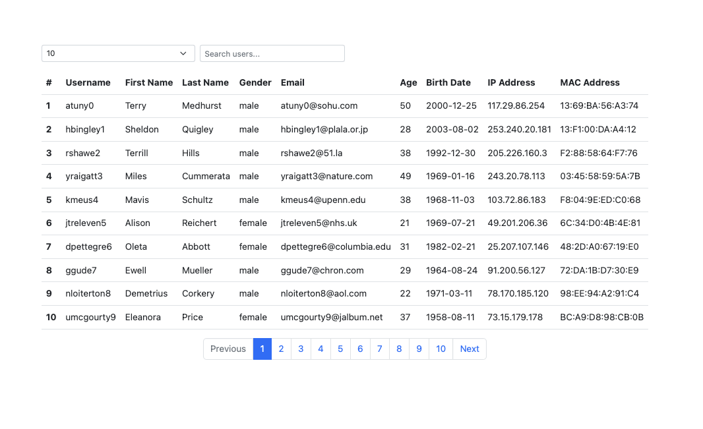

[Deploy-link](https://64b3f012b301bd358c8a2009--subtle-treacle-a22a01.netlify.app/)

# Users API task

## endpoint: [DummyJSON](https://dummyjson.com/docs/users)

use [Bootstrap](https://getbootstrap.com) as ui library 

### Micro tasks:

- get all users
- show them in table
- add sume styles with bootstrap
- add pagination
- add search
- add filter
